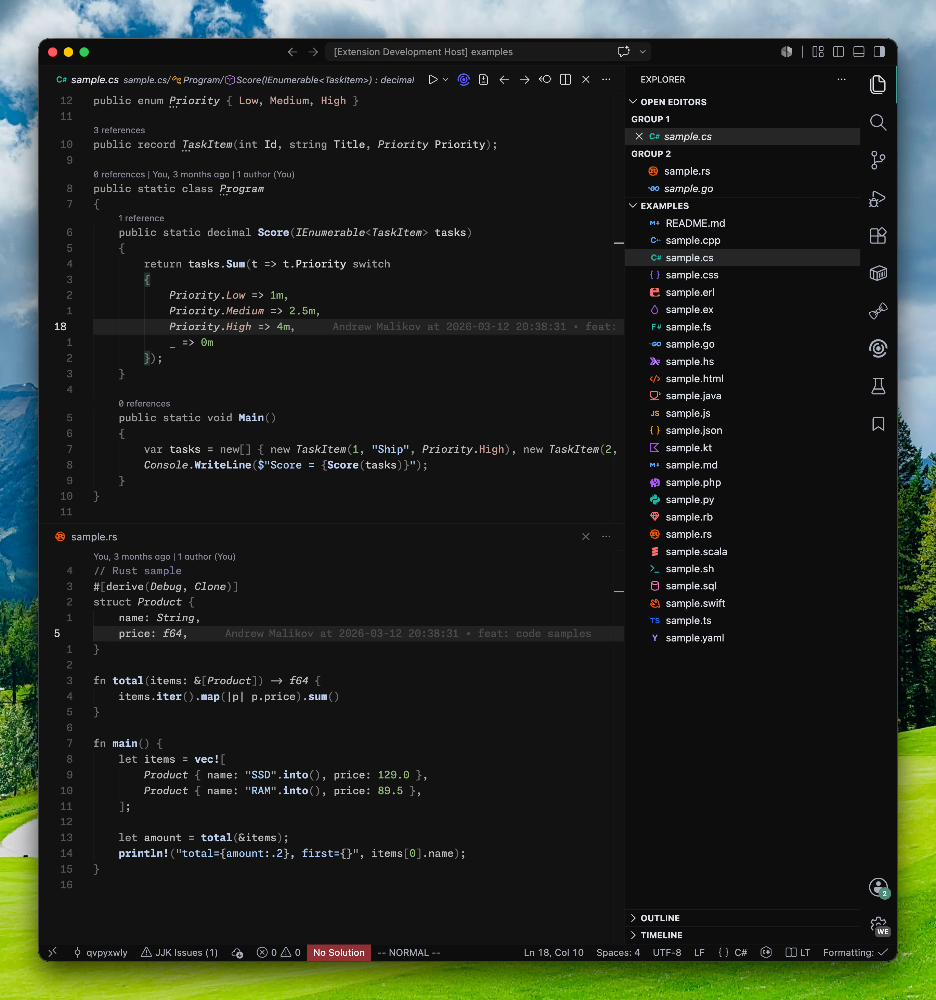

# Window Theme

## Build

1. Install dependencies with `mise install` or make sure `bun` is available.
2. Run `bun run build` to regenerate `themes/window_dark.json` and `themes/window_light.json` from `src/`.
3. Run `bun run package` to rebuild the themes and create a VS Code extension package.

## Color Source

- Syntax colors come from [`src/palette.ts`](./src/palette.ts).

## Structure

- `src/write-themes.ts`: writes the generated theme JSON files.
- `src/build.ts`: merges UI colors, token rules, and semantic tokens into each theme.
- `src/ui/`: editor and workbench colors.
- `src/tokens/` and `src/semantic/`: shared token and semantic token rules.
- `src/languages/`: language-specific scope overrides.
- `src/specialized/`: focused rules for cases like diff, regex, markup, and embedded code.
- `themes/`: generated output consumed by VS Code.

## Theme Intent

The theme keeps semantic signals easy to spot while boilerplate syntax stays quieter. Types, calls, strings, and other meaningful code should surface first; punctuation, modifiers, and similar syntax noise should support the read without competing for attention.
